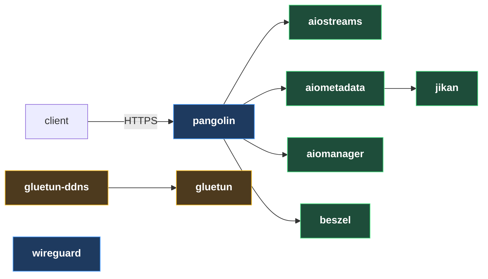

# Usenet Streaming Guide

Every service I run on my own server, with the compose file, the `.env`, and the steps to
get it working. This is the exact stack I use daily — not a survey of options.

Start with **[Redhair's Selfhosting Guide](https://redhair.gitbook.io/redhair-guides/selfhosting-guide-gui-version)**.
It gets you a VPS, a domain, Pangolin and Dockhand. This guide picks up from there and adds
everything else.

---

## How it fits together



---

## Setup

**[pangolin](docs/pangolin.md)** — installed via Redhair's guide. Every service below that
you reach from a browser needs a resource on it, and this page has that procedure plus how
to update Pangolin.

## Services

Deploy in this order. Each one creates or attaches to a Docker network the next depends on.

| # | Service | What it does |
|---|---|---|
| 1 | **[gluetun](docs/gluetun.md)** | VPN tunnel, exposed as an HTTP proxy on `gluetun:8888` |
| 2 | **[aiostreams](docs/aiostreams.md)** | The Stremio addon everything else feeds |
| 3 | **[aiometadata](docs/aiometadata.md)** | Metadata, artwork and catalogs |
| 4 | **[jikan](docs/jikan.md)** | Local MyAnimeList API, so anime lookups aren't rate limited |
| 5 | **[aiomanager](docs/aiomanager.md)** | Stremio account and addon management |
| 6 | **[gluetun-ddns](docs/gluetun-ddns.md)** | Keeps gluetun's endpoint IP current |
| 7 | **[wireguard](docs/wireguard.md)** | VPN into the host for admin access |
| 8 | **[beszel](docs/beszel.md)** | Resource monitoring |

---

## Deploying

Every stack has a ready directory under [`stacks/`](stacks/):

```
stacks/<name>/compose.yaml
stacks/<name>/.env.example
```

In Dockhand: **Stacks → Create**, paste `compose.yaml` into the compose panel and
`.env.example` into the `.env` panel beside it, fill in every `CHANGEME_` value, deploy.

---

MIT licensed. Built on [Redhair's guides](https://redhair.gitbook.io/redhair-guides).
